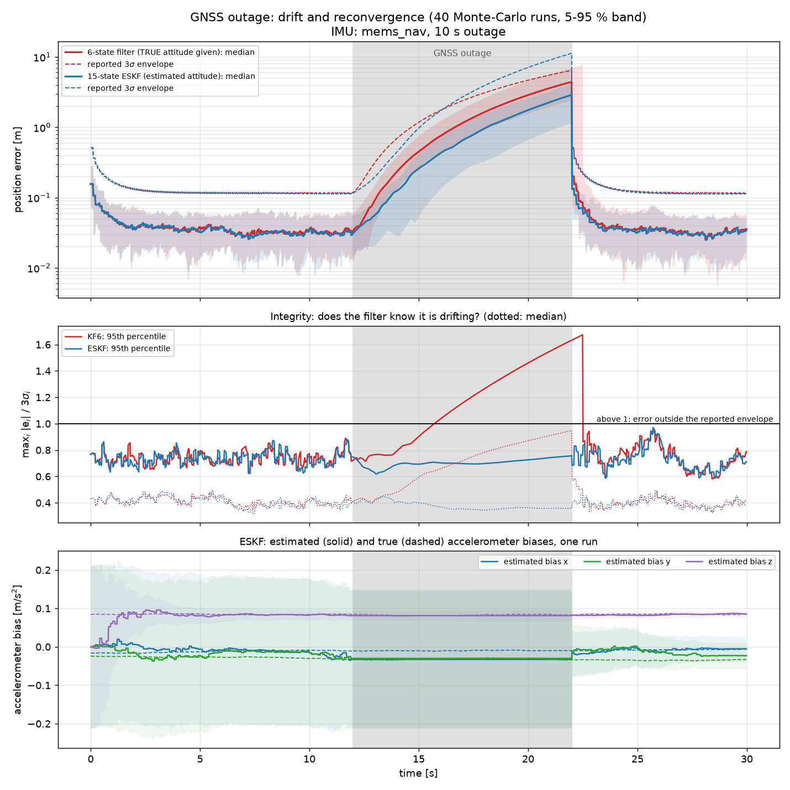
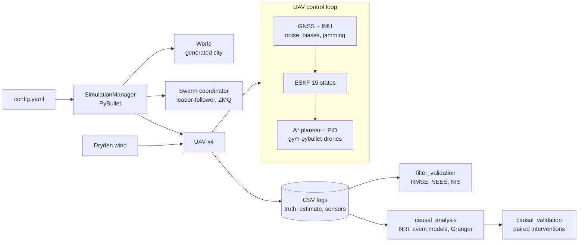

# Drone swarm simulator: GNSS/INS navigation and causal analysis of failures


A PyBullet simulator of a quadrotor swarm (leader–followers + an independent
drone) flying through a generated city, with realistic GNSS/IMU sensors, a
**15-state error-state Kalman filter**, and a **causal analysis** that explains
why drones fail, validated against controlled interventions.

Started as a 5-month research internship at the **Autonomous and Intelligent
Systems Lab, KAIST** (Prof. Hyo-Sang Shin, 2025–2026), as a team of two
ISAE-Supméca students; extended afterwards (navigation filter, statistical
validation, causal verification). See [who did what](#who-did-what).

## Key results

| | |
|---|---|
| **Navigation filter** | ESKF consistent on 24 Monte-Carlo flights × 4 drones: NEES 5.8–6.1 (expected 6), NIS 5.95–6.03 (expected 6), position RMSE 3.8–4.0 cm, about 4.5× better than raw GNSS |
| **Accelerometer bias** | drone_2 has a 0.5 m/s² accelerometer offset: the ESKF estimates it and stays consistent, the 6-state baseline becomes 3× less accurate and over-confident (NEES 55.9 instead of 6) |
| **GNSS outage (10 s)** | ESKF drift 2.9 m (median) and error inside its 3σ envelope 100 % of the time; the 6-state filter, even given the true attitude, drifts 4.4 m and leaves its envelope: it is wrong without knowing it |
| **Causal analysis** | in replayed flights with one injected perturbation, the analysis blames the right drone and the right cause: GNSS jamming of drone_1 → 89 % of its navigation losses attributed to GNSS; wind burst on drone_2 → wind cited for drone_2 only; no false attribution in nominal flights |

### GNSS outage: drift and integrity



The ESKF learns the IMU biases before the outage (bottom panel) and drifts less.
Middle panel: above 1, the error is outside the envelope the filter reports.

### Does the causal analysis find the right cause?


Same flights replayed with one perturbation. Left: what really happened. Right:
what the analysis concludes from the logs **without knowing** the perturbation.

Details, limits and reliability assessment:
[docs/navigation.md](docs/navigation.md) · [docs/causal_analysis.md](docs/causal_analysis.md)

## Architecture



## Who did what

**Adrian Ujkaj, during the internship**:
- realistic sensor models: GNSS with noise and time-windowed jamming, IMU
  measuring specific force in the body frame (`entities/sensor.py`);
- the navigation filter (6-state EKF) and the synchronised CSV logging that feeds
  the analysis (`Control/EKF.py`, `entities/uav.py`);
- the whole causal analysis module: log alignment, failure detection, NRI
  (PyTorch), logistic root-cause attribution, Granger tests
  (`analysis/causal_analysis.py`).

**Adrian Ujkaj, after the internship** (2026):
- 15-state error-state Kalman filter and IMU modelled as increments
  (`Control/ESKF.py`, `entities/sensor.py`);
- statistical filter validation (Monte-Carlo NEES/NIS) and GNSS outage study
  (`analysis/filter_validation.py`, `analysis/nav_replay.py`, `analysis/gnss_outage.py`);
- causal analysis redesign (physical failure thresholds, separation of causes and
  mediators, NRI checked on unseen flights) and its interventional validation
  (`analysis/causal_validation.py`, `analysis/run_causal_study.py`);
- simulator fixes found during validation: wind model, drag frame, control rate,
  thrust limits, formation layout; test suite (53 tests).

**Lucas Morvan** (internship partner): procedural city
and heightmap-based A* planner, original Dryden wind model, swarm messaging and
radar station, quadrotor dynamics (`environment/`, `Control/Path_planning.py`,
`swarm/`, `entities/static_sensor.py`).

Shared: simulator architecture (`simulator/simulator_manager.py`, `entities/uav.py`).
The commit history shows the individual contributions.

## Quick start

**Windows:** run `setup_windows.bat`. It installs Miniforge if needed, creates a
local environment in `.conda\` (PyBullet from conda-forge) and launches a
simulation. Helper scripts: `scripts\windows\lancer_tests.bat`,
`scripts\windows\etude_causale.bat`.

**Linux / macOS:**

```bash
python -m venv .venv && source .venv/bin/activate
pip install -r requirements.txt
pip install --no-deps https://github.com/utiasDSL/gym-pybullet-drones/archive/refs/heads/main.zip
```

**Run:**

```bash
python main.py                                       # simulation with the PyBullet GUI
python -m pytest                                     # test suite (~1 min)
python analysis/filter_validation.py --runs 24       # navigation filter validation
python analysis/run_causal_study.py --runs 6         # causal study, quick version
```

Scenarios live in `config.yaml` (world, swarm, drones, sensors, wind). Any key can
be overridden per drone, e.g. strong jamming of drone_1:
`--agent-override '{"@drone_1": {"sensors": {"gnss": {"jam_start": 8, "jam_end": 22, "jam_multiplier": 100}}}}'`.

## Repository layout

```
main.py                  entry point: python main.py [config.yaml]
config.yaml              scenario: world, swarm, drones, sensors, wind
simulator/               SimulationManager: PyBullet setup and main loop
entities/                UAV (control, planning, logging), GNSS/IMU sensors, radar
Control/                 ESKF (15 states), 6-state filter, A* planner
swarm/                   leader-follower formation coordinator (ZMQ)
environment/             generated city, wind model
utilities/               quaternions, buffered CSV logging, config loading
analysis/                filter validation, GNSS outage, causal analysis and validation
tests/                   pytest suite (filters, sensors, simulation, causal tools)
docs/                    method, results and limits
scripts/windows/         double-click launchers (tests, causal study)
```

Code comments and console messages are in French.

## Limitations

- Swarm messages go through ZMQ in real time: two flights with the same seed are
  not bit-identical. The interventional validation accounts for it
  (difference-in-differences, exclusion of pairs that diverge beforehand).
- The swarm coordinator reads true positions (centralised design); GNSS latency
  is not modelled; no magnetometer (yaw drifts in hover).
- The causal analysis is validated on one swarm geometry and two perturbation
  types; its percentages are indicative, not calibrated
  ([details](docs/causal_analysis.md#how-reliable-is-it)).

## Acknowledgements

KAIST AIS Lab and Prof. Hyo-Sang Shin; ISAE-Supméca. Quadrotor model and PID
controller from [gym-pybullet-drones](https://github.com/utiasDSL/gym-pybullet-drones).
NRI: Kipf et al., *Neural Relational Inference for Interacting Systems*, ICML 2018.
ESKF: J. Solà, *Quaternion kinematics for the error-state Kalman filter*, 2017.
